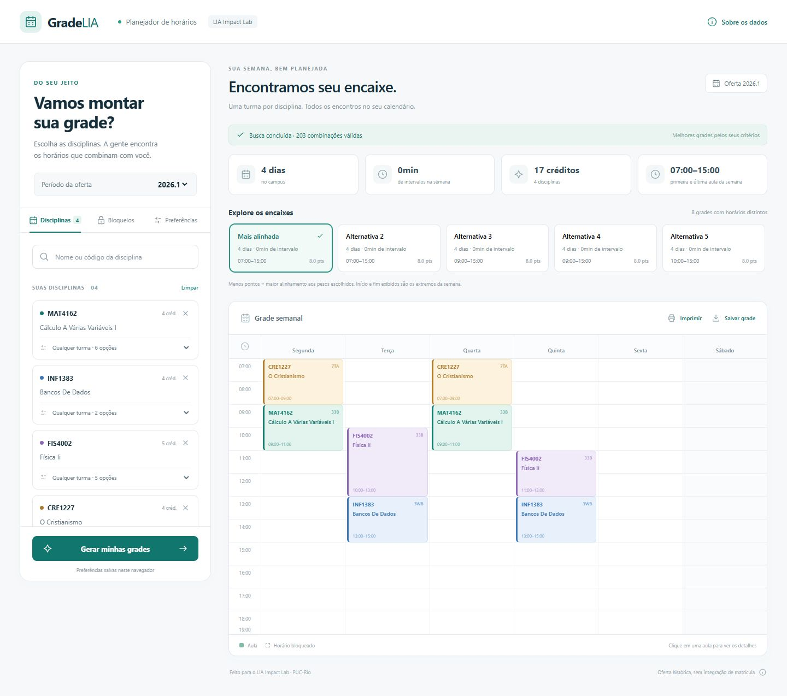

# Validação — 01/10/2026

Executada pelo agente; aceitação humana pendente. Windows, Node.js 22.23.2, navegador embutido do Codex. Tempos são amostras desta máquina, não garantia.

## Automatizada

`npm run build`: TypeScript e Vite concluídos. `npm run lint`: sem erros. `npm test`: 13 testes passaram, nenhum falhou.

A [CI no GitHub](https://github.com/ribeirore/grade-horaria-automatizada/actions/runs/36920267486) passou no commit `49d9416` da `feature`, executando `npm ci`, lint, testes e build em Ubuntu/Node 22. Nenhum job de publicação foi executado. Os CSVs mantêm os bytes originais entre sistemas via `.gitattributes`; hashes conferidos localmente.

Suíte: CSV com aspas/vírgulas/quebras citadas, adjacência, encontros indivisíveis, bloqueios, turma fixada, créditos/métricas, início cedo/tarde/fim cedo, impossibilidade por pares/global, busca limitada, conflito interno, busca textual e integridade dos dados. Enumerador por produto cartesiano sem poda confere contagem/custo mínimo em 40 casos pequenos.

Base real: dois períodos, todas as 4.943 turmas e 7.942 encontros incluídos, sem duplicatas ou conflito interno. Exemplo 2026.1 confere 203 combinações e todas as alternativas retornadas sem choque.

## Interação no navegador

| Cenário | Evidência |
| --- | --- |
| MAT4162, INF1383, FIS4002, CRE1227 | 203 combinações, oito alternativas; compacto: 0min de intervalo, quatro dias, 17 créditos |
| Começar tarde | Ranking mudou; melhores extremos 10h–17h |
| Trocar alternativa e clicar aula | Calendário muda; modal mostra todos os encontros |
| MAT4162 fixada 33E | 50 combinações; segunda/quarta 13h–15h respeitados |
| Recarregar | Seleção/preferência/trava preservadas; resultado recalculado sob demanda |
| Período 2025.2 / INF1383 | Seleção anterior limpa; duas turmas e alternativas do período correto |
| Bloqueio 18h–13h depois de editar nome | Rejeitado; nenhum bloco adicionado |
| Bloqueio 13h–18h segunda a sexta | Cinco blocos; exemplo inviável com explicação para INF1383 |
| Repetir bloqueio | Aviso, total inalterado |
| Limpar bloqueios | Geração possível novamente |
| Tela 390×844 | Após correção, página e largura útil iguais (375px); rolagem interna na grade/alternativas |
| Build compilado em preview local (porta 4173) | Oferta carregada, Web Worker funcionando, 203 combinações / oito alternativas; console sem erros capturados |

Após feedback da equipe, linhas passaram de 54px para 42px, mantendo posição/duração proporcionais. Blocos curtos priorizam código/turma/horário; detalhes completos ficam no modal.

## Desempenho

Mesmo exemplo, perfil compacto, sem bloqueios/travas; execução Node:

| Caso | Completa | Combinações válidas | Nós | Tempo |
| --- | --- | ---: | ---: | ---: |
| 2026.1 | Sim | 203 | 252 | 36,4ms |
| 2025.2 | Sim | 253 | 290 | 10,4ms |
| Sintético: seis disciplinas × 20 opções em dias independentes | Não | 262.165 encontradas | 275.968 | 3.501,8ms |

O sintético tem 64 milhões de combinações potenciais, criado **só para teste**, não alimenta a aplicação. Retornou oito grades e `complete=false`, sem alegar ótimo.

## Não confirmado

- Download JSON implementado; evento não retornou dentro do prazo da automação embutida. Conferir no Chrome/Edge normal.
- Impressão implementada, saída precisa de conferência manual, especialmente horários extensos.
- Hospedagem não realizada por instrução da equipe; nenhum teste em produção declarado.
- Aceitação por alunos, auditoria completa de acessibilidade e compatibilidade ampla.
